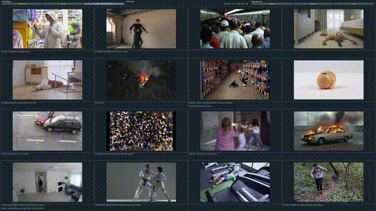
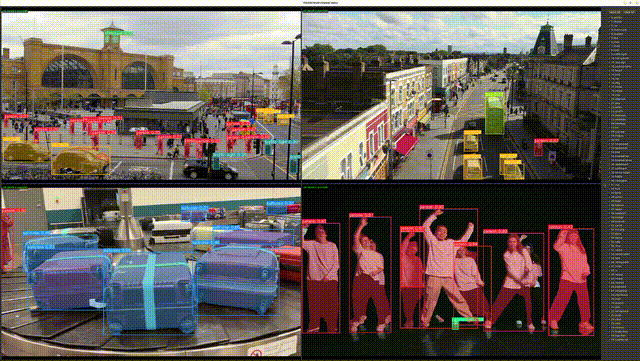
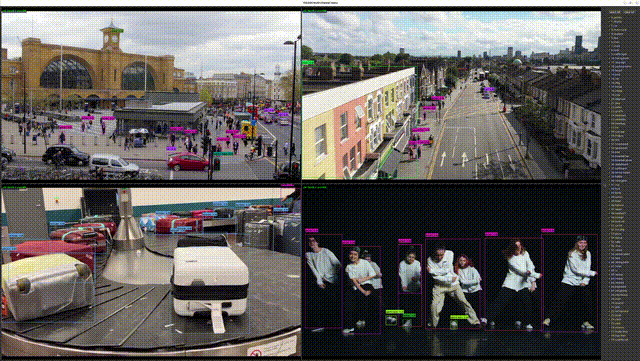

# DX-DEMO

A collection of demo applications for DEEPX NPU inference.

## Demos

| Demo | Model | Description |
|------|-------|-------------|
| [dx_clip_demo](https://github.com/DEEPX-AI/dx_clip_demo) | CLIP | Real-time text-video similarity matching powered by CLIP on DeepX NPU |
| [yolo26seg_4ch_demo](yolo26seg_4ch_demo/README.md) | YOLOv11 Segmentation | Real-time instance segmentation with mask overlay across up to 4 input channels |
| [yolo26_4ch_demo](yolo26_4ch_demo/README.md) | YOLO26 | Real-time object detection with per-class BBOX toggle panel across up to 4 input channels |

## Screenshots

### DX-CLIP Demo



### YOLO26 Segmentation 4-Channel Demo



### YOLO26 4-Channel Demo



## Prerequisites

### dx_clip_demo

Requires **DX-RT** (DeepX Runtime) to be built and installed.

```python
# Verify DX-RT is available
import dx_engine
```

### yolo26_4ch_demo / yolo26seg_4ch_demo

Requires **dx_stream** (GStreamer plugin) and **pydxs** Python bindings in the venv.

```bash
# Verify dx_stream GStreamer plugin is registered
gst-inspect-1.0 dxinfer

# Verify pydxs is importable in the venv
python -c "import pydxs"
```

If either fails, install dx_stream first (see each demo's `README.md` for instructions). The venv activated by `run_demo.sh` must have `pydxs` installed.

## Demo Details

- **[dx_clip_demo](https://github.com/DEEPX-AI/dx_clip_demo)** — Real-time text-video similarity matching using the CLIP model accelerated on DeepX NPU. Supports up to 16 video channels, camera input, and configurable GUI options.
- **[yolo26seg_4ch_demo](yolo26seg_4ch_demo/README.md)** — Uses a C++ Python binding (`dx_postprocess`) to accelerate pixel-level mask overlay operations for real-time multi-channel segmentation.
- **[yolo26_4ch_demo](yolo26_4ch_demo/README.md)** — Features a class list panel in the Qt GUI with per-class checkboxes to toggle BBOX display individually. Uses the YOLO26 detection model.
