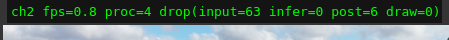

> Korean documentation: [README-ko.md](README-ko.md)

# YOLO26 Multi-Channel Demo

A multi-channel Qt demo application using the YOLO26 detection model.

- The Qt GUI has a **class list panel** on the right side, where each class has a checkbox
  to individually control whether the BBOX for that class is displayed.

## Screenshot


## Prerequisites

Before running this project, **DX-RT** (DeepX Runtime) must be built and the `dx_engine` module must be importable in Python.

```python
# The following must run without errors
import dx_engine
```

Refer to the DX-RT project documentation for installation and build instructions.

## Installation

Run the demo with:

```bash
./run_demo.sh
```

`run_demo.sh` automatically checks and installs what is missing before starting:
1. Installs any missing Python dependencies (`requirements.txt`)
2. Downloads sample videos into `assets/videos/` if not present

To install manually without running the demo:

```bash
./install.sh
```

## Configuration

Edit [`demo/config/yolo26_multich.yaml`](demo/config/yolo26_multich.yaml) to match your environment.

### Configuration Options

```yaml
# Model file path (DXNN format)
model: "assets/models/yolo11s-seg_optim.dxnn"

# Video decoding mode (global default, can be overridden per channel)
#   auto : HW decode when supported, otherwise SW (default)
#   hw   : force HW decode (falls back to SW if unavailable)
#   sw   : force SW decode
decode: "auto"

# Worker thread counts
workers:
  preprocess: 1   # Pre-processing workers
  wait: 1         # Inference wait workers
  draw: 1         # Rendering workers

# Input channel configuration (up to 4 channels)
channels:
  - name: "ch1"               # Channel name
    type: "video"             # Input type: video, rtsp, camera
    source: "assets/videos/example.mov"  # Input source path
    enabled: true             # Enable/disable channel
    max_fps: 25              # Maximum FPS

  - name: "ch2"
    type: "rtsp"
    source: "rtsp://192.168.1.100:8554/stream"
    enabled: true
    max_fps: 25

  - name: "ch3"
    type: "camera"
    source: 0                 # Camera device index
    enabled: false
    max_fps: 25
```

**Source value by input type:**
- `video`: Path to a video file
- `rtsp`: RTSP stream URL
- `camera`: Camera device index (0, 1, 2, ...)

### Inference Backend (`engine_backend`)

```yaml
# Inference backend selection
#   legacy   : Python dx_engine inference (default). dx_stream is OPTIONAL —
#              on RK3588 the dxconvert/dxscale elements are used for RGA
#              acceleration only if present, otherwise it falls back to plain
#              GStreamer / software decoding.
#   dxstream : Native GStreamer inference (dxpreprocess -> dxinfer ->
#              dxpostprocess), detections read back via pydxs. This backend
#              REQUIRES dx_stream and its pydxs bindings to be installed; it has
#              NO software fallback. If they are missing, startup aborts with a
#              clear error instead of showing a black screen.
engine_backend: "legacy"
```

> **Note:** Neither `requirements.txt` nor `install.sh` installs dx_stream. The
> `dxstream` backend (and the optional RGA acceleration path of the `legacy`
> backend) assume dx_stream is already installed on the machine, with its
> GStreamer plugins reachable via `GST_PLUGIN_PATH`.

## Hardware-Accelerated Decoding (GStreamer)

By default each channel decodes video on the CPU (software). Setting `decode: "auto"`
(or `"hw"`) offloads decoding to the platform hardware decoder through a GStreamer
pipeline (`cv2.VideoCapture(..., cv2.CAP_GSTREAMER)`), reducing CPU load when running
multiple high-resolution channels.

**Platform is auto-detected:**

| Platform | HW decoder | Required plugin |
|---|---|---|
| RK3588 (Orange Pi 5 Plus) | `mppvideodec` | included in the official Rockchip image |
| Intel iGPU | VAAPI (`vaapidecodebin`) | `sudo apt install gstreamer1.0-vaapi` |

**Prerequisites:**

1. **OpenCV must be built with GStreamer support.** The PyPI `opencv-python` wheel is
   built **without** GStreamer. Verify with:
   ```bash
   python -c "import cv2; print(cv2.getBuildInformation())" | grep -i gstreamer
   ```
   If it prints `GStreamer: NO`, install a GStreamer-enabled OpenCV (the RK3588 system
   image already provides one; on other platforms use the distro `python3-opencv`
   package or a custom build). **`install.sh` enforces this automatically** via
   `scripts/ensure_gstreamer_opencv.sh`: it verifies GStreamer support and, when
   missing, installs the distro `python3-opencv` + GStreamer plugins and removes the
   shadowing pip wheel; the install **fails with guidance** if a GStreamer-enabled
   OpenCV still cannot be provided (e.g. inside a venv created without
   `--system-site-packages`).
2. Install the platform decoder plugin from the table above.

**RGA-accelerated colour conversion (RK3588):**

On RK3588, when the dx_stream GStreamer plugin's `dxconvert` element is available, the
demo inserts it into the decode pipeline so the **NV12→RGB conversion runs on the RGA
hardware** instead of the CPU. The pipeline then delivers `RGB` frames and the demo runs
**RGB end-to-end**, skipping the two redundant `cvtColor` calls (preprocess and paint).
This is detected automatically (`gst-inspect-1.0 dxconvert`); if `dxconvert` is missing,
the demo falls back to the CPU `videoconvert`→`BGR` path. The captured colour order is
reported per channel at startup, e.g. `decode=HW (GStreamer) color=rgb (video)`.

If either prerequisite is missing, the demo automatically **falls back to software
decoding** and prints the reason per channel at startup, e.g.:

```
[INFO] Channel 0: decode=SW color=bgr (video) - OpenCV built without GStreamer support; using SW decode
```

> **Note on performance:** HW decoding reduces CPU usage. On RK3588 the RGA `dxconvert`
> path additionally offloads colour conversion and removes the two CPU `cvtColor` steps,
> which directly relieves the preprocess bottleneck (the main cause of input drop with
> many high-resolution channels).

## Running


```bash
./run_demo.sh
```

## Performance Tuning

The demo shows per-stage frame drop counters in the title bar. Use them to identify bottlenecks and adjust `workers:` counts in [`demo/config/yolo26_multich.yaml`](demo/config/yolo26_multich.yaml).



> The screenshot above shows `input drop` increasing — this means the preprocess workers cannot keep up with the capture rate. Increase `workers.preprocess` to resolve this.

| Drop counter | Bottleneck | Action |
|---|---|---|
| `input drop` | Preprocess workers are too slow | Increase `workers.preprocess` |
| `infer drop` | Inference wait workers are too slow | Increase `workers.wait` |
| `draw drop` | Rendering is too slow | Increase `workers.draw` |

```yaml
workers:
  preprocess: 1   # increase if input drop is high
  wait: 1         # increase if infer drop is high
  draw: 1         # increase if draw drop is high
```

> Optimal values depend on your hardware (CPU cores, NPU throughput, number of active channels).

## Project Structure

- `demo/main.py` - Qt GUI main application
- `demo/engine.py` - YOLO26 inference engine wrapper
- `demo/workers.py` - Multi-threaded workers (capture / pre-process / post-process)
- `demo/config/yolo26_multich.yaml` - Configuration file
- `assets/models/` - DXNN model files
- `assets/videos/` - Test video files
